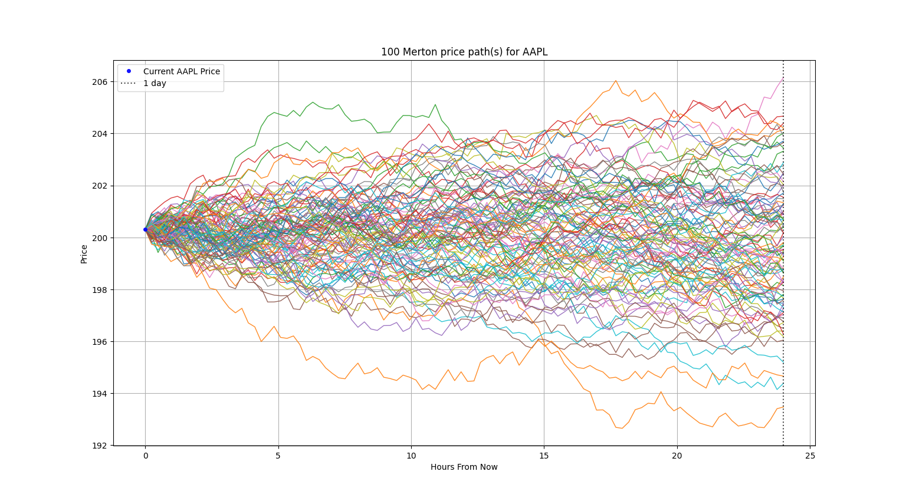
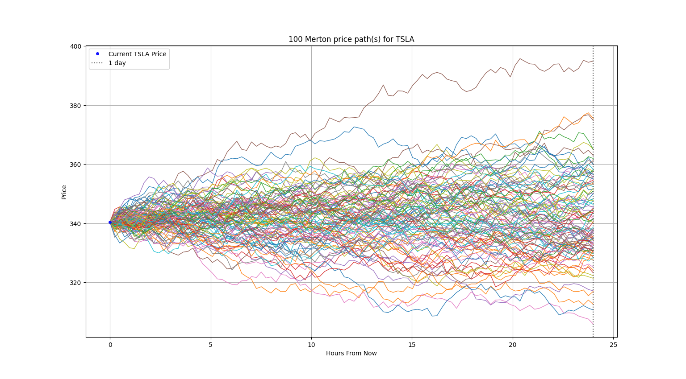

# Merton Jump Diffusion Model: Advanced Asset Price Simulation

---

## Overview

This project showcases an implementation of the **Merton Jump Diffusion Model (JDM)**, a financial model for commonly used for forecasting equity price paths. Building upon conventional continuous-time models, the Merton JDM uniquely incorporates **random "jumps"** to simulate sudden, significant market movements caused by unexpected events like earnings surprises, policy shifts, or economic shocks.

This documentation provides a clear explanation of the model's core principles, its mathematical formulation, and a high-level overview of its efficient **Python and C++ implementation**.

---

## What is the Merton Jump Diffusion Model?

The **Merton Jump Diffusion Model (JDM)** enhances traditional continuous stochastic processes by integrating a **jump component** into the asset price dynamics. This allows the model to capture abrupt, discontinuous price changes, which are characteristic of real-world financial markets.

The JDM formula extends the Geometric Brownian Motion (GBM) equation:

$$S_t = S_0 e^{(\mu - 0.5 \sigma^2 - k\lambda)t + \sigma W_t + \sum_{i=1}^{N(t)} J_i}$$

Here, while the standard GBM variables ($$S_t, S_0, \mu, \sigma, t, W_t$$) retain their definitions, the model introduces crucial jump-related terms:

* $$k$$: Represents the **mean jump size**, specifically the logarithmic average of all jumps. This term subtly adjusts the overall drift to maintain the model's unbiased nature.
* $$\lambda$$: Denotes the **average number of jumps per unit of time**, often referred to as jump intensity or frequency.
* $$N(t)$$: Modeled as a **Poisson process**, this variable dictates the total count of jumps occurring up to time $$t$$.
* $$J_i$$: Signifies the **size of the $$i$$-th jump**, typically drawn from a log-normal distribution to reflect realistic jump magnitudes.

---

## Mathematical Explanation of Jump-Related Variables

Understanding the mathematical foundation of the jump components is key to appreciating the Merton JDM's power:

* **Jump Intensity ($$\lambda$$):** This parameter quantifies how frequently significant price jumps are expected. For instance, if the chosen time period is one year and we observe 10 jumps, then $$\lambda$$ would be 10 jumps per year. In our implementation, $$\lambda$$ is derived directly from the observed number of significant jumps within a one-year historical data window.

* **Average Jump Size ($$k$$):** This is the average of the natural logarithm of (1 + proportional jump size). It's calculated to ensure that the jump component doesn't introduce bias into the long-term drift. The formula is:

  $$k = \text{mean}(\ln(1 + J))$$

    For example, if a stock had proportional jumps of 47%, -33%, -10%, and 89%, $$k$$ would be the average of $$\ln(1.47), \ln(0.67), \ln(0.90), \ln(1.89)$$ . This careful calculation ensures the model accurately reflects the average impact of discrete events.

* **Jump Process ($$N(t)$$):** The number of jumps over time $$t$$ is determined by a **Poisson-distributed** random variable, expressed as $$N(t) \sim \mathcal{P}(\lambda t)$$. This probabilistic approach accurately reflects the unpredictable nature and infrequent occurrence of market jumps.

* **Jump Magnitude ($$J_i$$):** Each individual jump's size, $$J_i$$, is sampled from a distribution that ensures its logarithmic value follows a normal distribution. Specifically, $$\ln(1+J) \sim \mathcal{N}(\ln(1+k)- \frac{\sigma_j^{2}}{2}, \sigma_j^{2})$$. Here, $$\sigma_j$$ is the **jump volatility**, which represents the standard deviation of these logarithmic jump sizes. This accounts for the varying severity of real-world market shocks.

These integrated components allow the Merton JDM to simulate both continuous market fluctuations and discrete, impactful events, providing a more comprehensive and realistic financial forecasting tool.

---

## Implementation Overview

This Merton Jump Diffusion Model is engineered with a **hybrid architecture**, leveraging **Python** for its robust data handling and visualization capabilities, and **C++** for the computationally intensive Monte Carlo simulations. This design ensures both ease of use and high performance.

### Python (Orchestrator)

The Python component acts as the main orchestrator. It handles the initial data acquisition for a given stock using libraries like `yfinance`. Crucially, it calculates all necessary model parameters from historical data: the annualized mean return, volatility, average jump size ($$k$$), jump volatility ($$\sigma_j$$), and jump intensity ($$\lambda$$). It then interfaces with the C++ backend to generate price paths and finally processes and visualizes the simulation results using `matplotlib` and `numpy`.

* **Data Scraper:** Identifies and quantifies historical jumps by flagging daily percentage changes that exceed a certain threshold (e.g., 3 standard deviations of returns over a one-year period). This mechanism is key to extracting real-world jump data.
* **Parameter Calculation:** Computes the statistical inputs required by the Merton JDM, ensuring the model is calibrated with real market dynamics. For instance, the **jump intensity ($$\lambda$$)** is derived from the count of identified jumps over the historical period.

### C++ (High-Performance Simulation Engine)

The core logic for generating the Merton Jump Diffusion price paths resides in the C++ component, compiled as a Python module using `pybind11`. This is where the model's heavy lifting occurs, executing numerous Monte Carlo simulations efficiently.

* **Price Path Generation:** The C++ module's `price_path` function generates a series of price points for a single simulation path. This function iteratively applies the Merton JDM formula, incorporating random samples from standard normal, log-normal, and Poisson distributions for the Wiener process, jump magnitudes, and jump counts, respectively.
* **Performance Optimization:** By offloading the Monte Carlo loop to C++, the simulation benefits from native code execution speed, allowing for thousands or even millions of price paths to be generated rapidly, which is critical for accurate statistical analysis of potential future prices.

This integrated approach combines the flexibility of Python with the raw computational power of C++, resulting in a robust and efficient financial modeling tool.

---

## Demos

Here are examples of the model in action, simulating future prices for various stocks:

### Test 1: Berkshire Hathaway Inc. (Class B)

```
# BRK-B (Low Volatility)

Enter stock name: BRK-B
Enter number of paths: 100
==============================================
RESULTS (MAY VARY EACH RUN)
Stock chosen for analysis: BRK-B
Current Price = 487.77
Median Expected Price (1 day) = 487.54
Average Expected Price (1 day) = 487.63
Highest Simulated Price = 491.86
Lowest Simulated Price = 484.74
Chances of Price Increase = 43.00%
==============================================
```


### Test 2: Apple Inc.

```
# AAPL (Moderate Volatility)

Enter stock name: AAPL
Enter number of paths: 100
==============================================
RESULTS (MAY VARY EACH RUN)
Stock chosen for analysis: AAPL
Current Price = 201.50
Median Expected Price (1 day) = 201.50
Average Expected Price (1 day) = 201.49
Highest Simulated Price = 205.71
Lowest Simulated Price = 198.61
Chances of Price Increase = 50.00%
==============================================
```




### Test 3: Tesla Inc.

```
# TSLA (High Volatility)

Enter stock name: TSLA
Enter number of paths: 100
==============================================
RESULTS (MAY VARY EACH RUN)
Stock chosen for analysis: TSLA
Current Price = 348.68
Median Expected Price (1 day) = 348.36
Average Expected Price (1 day) = 348.61
Highest Simulated Price = 364.55
Lowest Simulated Price = 329.71
Chances of Price Increase = 49.00%
==============================================
```



